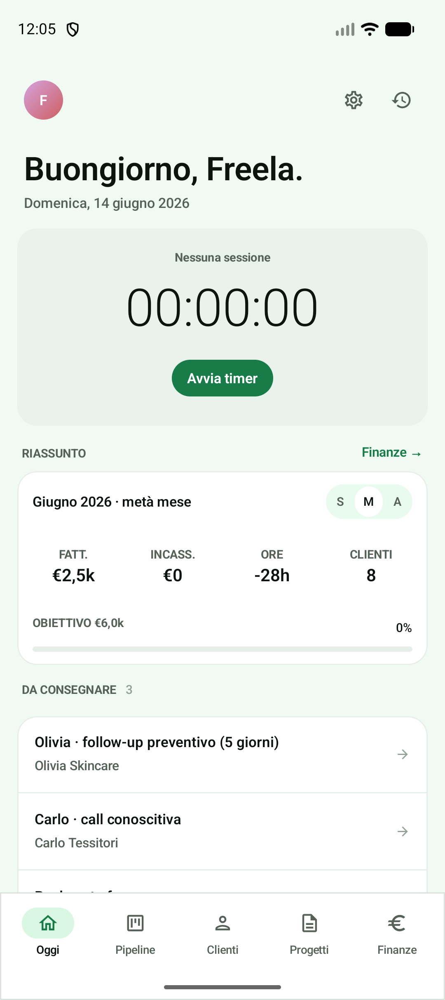
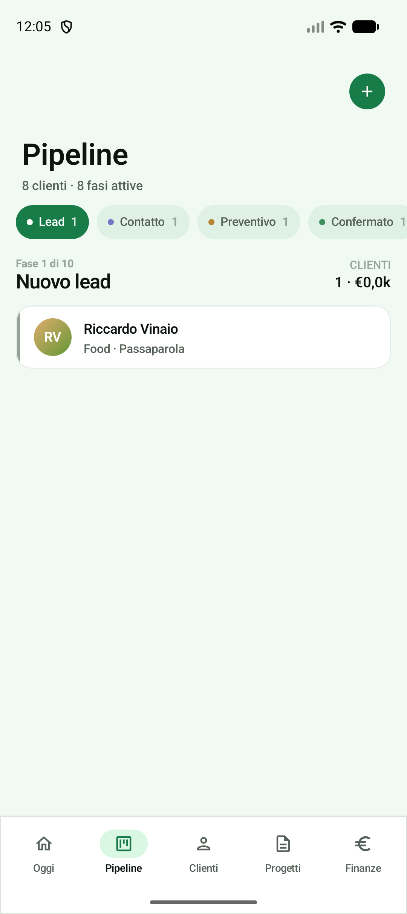
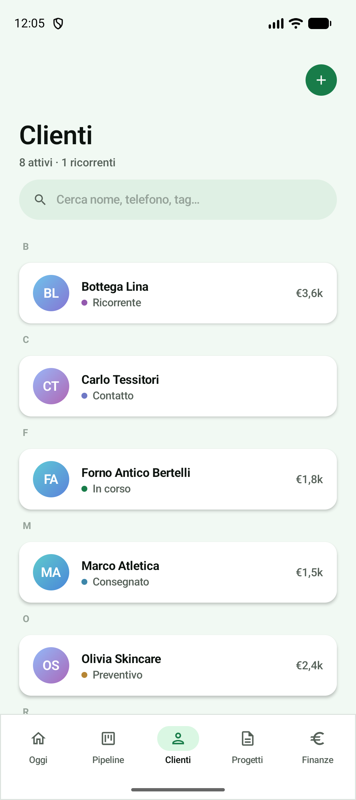
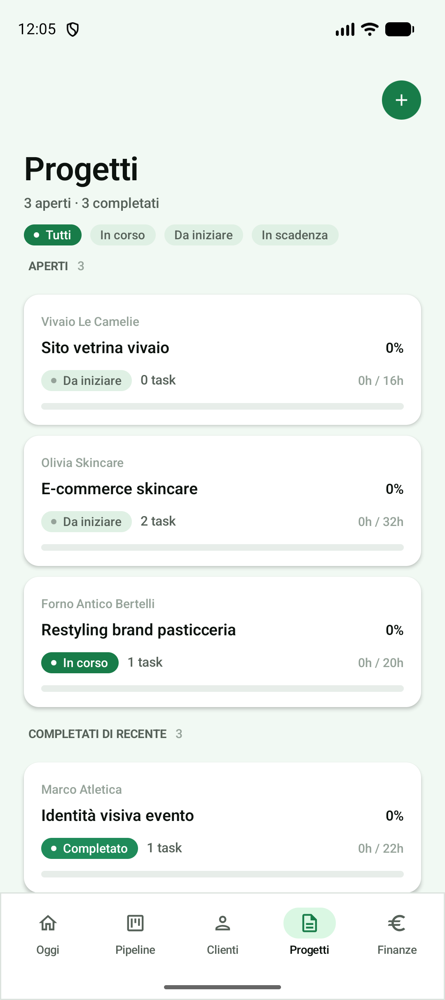
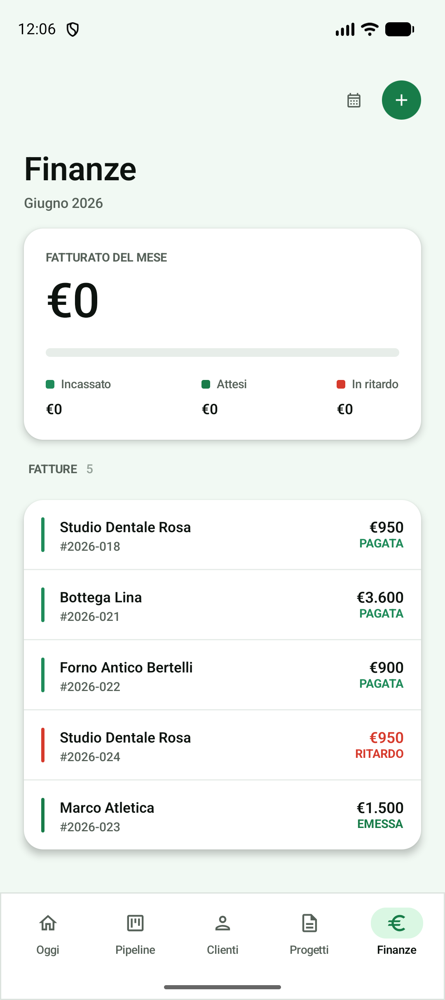

# Freela

Freela è un'app Android pensata per chi lavora come freelance: tiene insieme in un
unico posto i clienti, le scadenze, le ore lavorate e i pagamenti. Funziona anche
offline.

Il progetto è stato sviluppato per il corso di **Sistemi Mobile e Tablet**
dell'**Università di Trento**.

## Cosa fa

- **Oggi** — riepilogo della giornata: timer, follow-up da fare e numeri del mese.
- **Pipeline** — i clienti organizzati in fasi, da primo lead a cliente ricorrente.
- **Clienti** — rubrica con stato di ogni cliente e totale fatturato.
- **Progetti** — progetti con task, stato di avanzamento e ore stimate.
- **Finanze** — fatture e incassi del mese (atteso, incassato, in ritardo).
- **Time tracking** — un timer che continua anche se chiudi l'app.
- **Notifiche** — promemoria per le scadenze e i solleciti di pagamento.

## Screenshot

<p>
  
  
  
  
  
</p>

## Tecnologie

- Kotlin + Jetpack Compose (Material 3)
- Hilt per la dependency injection
- Room per il database locale (offline-first)
- Navigation Compose
- WorkManager e AlarmManager per i reminder
- Foreground Service per il timer di time tracking

minSdk 26 · targetSdk 34

## Come avviarla

1. Apri il progetto in Android Studio.
2. Collega un dispositivo o avvia un emulatore (Android 8.0 o superiore).
3. Premi *Run*, oppure da terminale:

   ```bash
   ./gradlew installDebug
   ```

I dati di esempio (clienti, progetti, fatture) vengono caricati al primo avvio.
